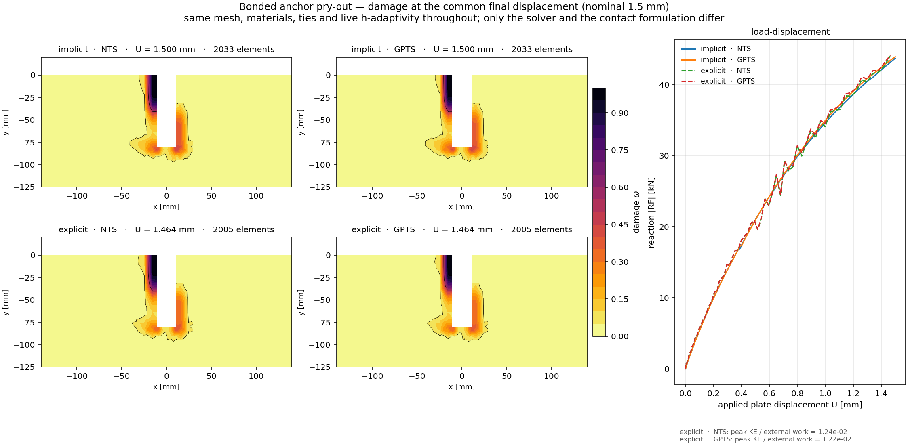

# Bonded anchor pry-out — a four-variant template

A bonded M20 anchor, embedded 80 mm in a concrete slab and loaded sideways through a fixture plate
until the concrete breaks out. The same model is set up **four times** — implicit and explicit, each
with two contact formulations — so you can see what changes and what does not.

|  | node-to-surface contact | Gauss-point-to-segment contact |
|---|---|---|
| **implicit static** | `pryout_implicit_nts.inp` | `pryout_implicit_gpts.inp` |
| **explicit dynamic** | `pryout_explicit_nts.inp` | `pryout_explicit_gpts.inp` |

All four ramp the plate to **the same 1.5 mm**, so they are comparable at equal load rather than at
equal time.

```bash
edelweissfe pryout_implicit_nts.inp        # see the table below for timings
python plot_damage_comparison.py           # once all four have run
```

Measured on 16 threads, one variant at a time, on a 64-core Threadripper (2026-09-30):

| variant | wall time | increments | refinement occasions | final concrete elements | final U | final reaction |
|---|---|---|---|---|---|---|
| `implicit_nts` | ~9 min | 100 + 1, no cutback | 40 | 2033 | 1.500 mm | 43.7 kN |
| `implicit_gpts` | ~10 min | 100 + 1, no cutback | 40 | 2033 | 1.500 mm | 43.9 kN |
| `explicit_nts` | ~13 min | ~69 900 | 12 | 2005 | 1.464 mm | 44.0 kN |
| `explicit_gpts` | ~9 min | ~69 900 | 12 | 2005 | 1.464 mm | 44.1 kN |

With the production settings (von Mises steel, penalty 1e4) the reaction is still rising at 1.5 mm:
the ramp stops before the breakout peak.

Each solver family reaches the same refined mesh in all its variants. The explicit runs stop at 1.464 mm
rather than 1.500 because the last *recorded* output tick falls just short of the final increment —
the ramp itself completes.

Run each in its own directory (the `*include` paths are relative to the working directory), and set
`OMP_NUM_THREADS` and `PYTHON_GIL=0` for the threaded element loop.

## What it exercises

Most of the features that make a real analysis awkward, in one model of a manageable size:

- **gradient-enhanced damage** (Marmot `gcdp` on `GC3D20R`) — softening concrete with an internal
  length, so the response is mesh-objective rather than localising into one element band
- **five tie constraints** — the fastener stack and the full bonded length, condensed out as
  multi-point constraints
- **two penalty contacts** — plate on concrete, and the shaft in the plate's clearance hole; these
  are the only genuinely unilateral interfaces
- **live h-adaptivity** — the mesh refines *during* the run wherever damage has started, roughly 20
  times, taking the concrete from 1634 to about 3000 elements. Ties and contacts are rebuilt around
  the new mesh each time.
- **both solvers on the same model** — the same mesh, materials, ties and contacts, driven to the
  same displacement by a Newton solve and by central differences

## How the files fit together

A variant is only the lines that make it that variant; everything shared is included once.

```
figures/damage_comparison.png     what plot_damage_comparison.py produces
pryout_<solver>_<contact>.inp     six includes and a *job — nothing else
├── materials_implicit.inc  or  materials_explicit.inc
├── model.inc                     mesh, sections, 14 interface surfaces, 5 ties
├── contact_nts.inc         or  contact_gpts.inc
├── adaptivity.inc                the live refinement marker
├── outputs.inc                   field outputs, Ensight, monitor
└── steps_implicit.inc      or  steps_explicit.inc     solver + steps + boundary conditions
```

Boundary conditions live in the step files rather than in one shared include, because `>>` option
lines cannot open an `*include` — the parser loses the enclosing keyword's context. A whole `*step`
block in an include is fine, which is why the seven Dirichlet conditions are written twice (once per
solver) instead of eight times.

To try a different contact formulation, change one include line. Nothing else about the model moves.



## Reading the two solvers against each other

They are the same problem, but an explicit integrator is not a drop-in replacement, and three of the
differences are consequences rather than choices. Each is argued where it is set:

| | implicit | explicit | why |
|---|---|---|---|
| densities | omitted | required, **×100 mass scaling** | a static solve builds no mass matrix; the explicit stable increment goes with 1/√ρ, and the scaling is what makes the run reach 1.5 mm in comparable time |
| Duvaut-Lions viscosity | `1e-6` | **`0`** | it is a relaxation time. At dT ≈ 3.4e-7 s nothing relaxes per increment, and a non-zero value makes the concrete respond nearly elastically — a run that completes, looks plausible, and shows no softening |
| AMR marker | damage | damage | deliberately the same, so the comparison is not confounded. A stress marker is defensible implicitly but ratchets towards refining everything under explicit integration |
| bulk viscosity | — | **b1 = 0.06, b2 = 1.2** on every element set, linear term degraded with damage (exponent 2.0) on the concrete | central difference dissipates nothing; undegraded, the linear term resists crack opening forever and inflates the fracture energy |
| nonlocal field | — (static) | **hyperbolic**: `eta = 3e-4`, `m_k = eta^2/4 = 2.25e-8` | `m_k > 0` integrates the nonlocal damage by central difference, whose stable increment scales with h, not h² |
| courant number | — | **0.1**, not the 0.8 default | `l/c` is a linear-element formula; a quadratic element's highest eigenfrequency is several times what it predicts. At 0.8 this model returns a reaction 26× too small **and does not fail** |

The mass scaling is the one to watch. It buys speed by making the structure heavier, which works
*against* quasi-staticity, so `plot_damage_comparison.py` integrates the reaction against the
displacement and reports the kinetic energy as a fraction of that external work.

**On this example that ratio ends at ~1.2 %** (kinetic energy against external work, as the
solver reports it at the last output), and the explicit final reaction lies within 1 % of the
implicit one; its remaining oscillation about the implicit curve is visible in the figure above. If you need a smooth
reaction history rather than a correct mean, reduce the mass scaling and lengthen the ramp, at a
proportional cost in increments. That trade-off, not the fact that the run completed, is what says
whether an explicit result is usable as a static one.

## The mesh is coarse on purpose

`l/h ≈ 0.12` near the anchor, against 0.55 on the production mesh in `examples/AnchorPryOut`, which
is itself not converged. The damage field is under-resolved by construction: this example exists to
be **runnable in half an hour**, not to predict a breakout cone. Treat the contours as a
demonstration of the machinery.

The mesh generator is not part of this repository (see the header of `model.inc`); for a finer
model, start from `examples/AnchorPryOut`.

## Where to take it next

- **restart** — add `*output, type=restart` and resume with `*restart, readFrom=...`. Restart is
  faithful across live refinement here: on this model a resumed run agrees with a continuous one to
  ~2e-15, against a no-restart control pair at ~2.2e-15.
- **a production-sized model** — `examples/AnchorPryOut` is the same physics at 280 k dof, with the
  `blockamg` linear-solver settings that make that size tractable
- **initial-only refinement** — if you would rather not have refinement events land in an already
  damaged field, mark a pry-out-cone-shaped element set once with `initialOnly=True` instead
