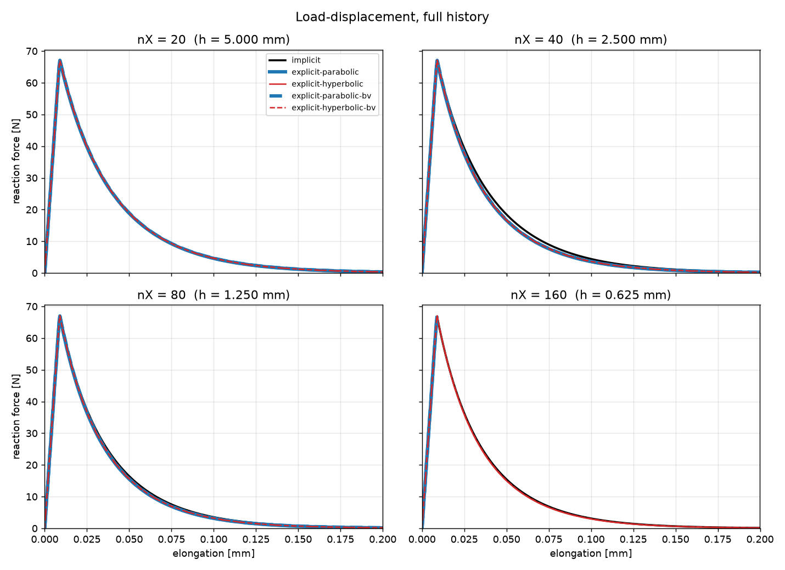
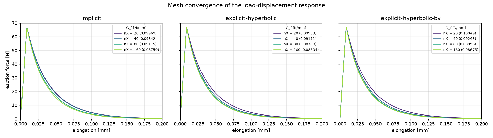
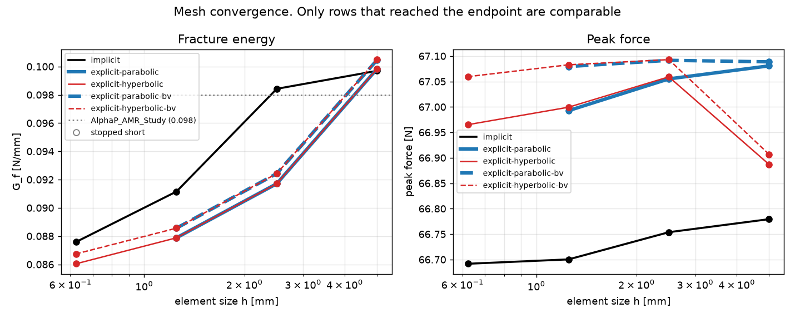
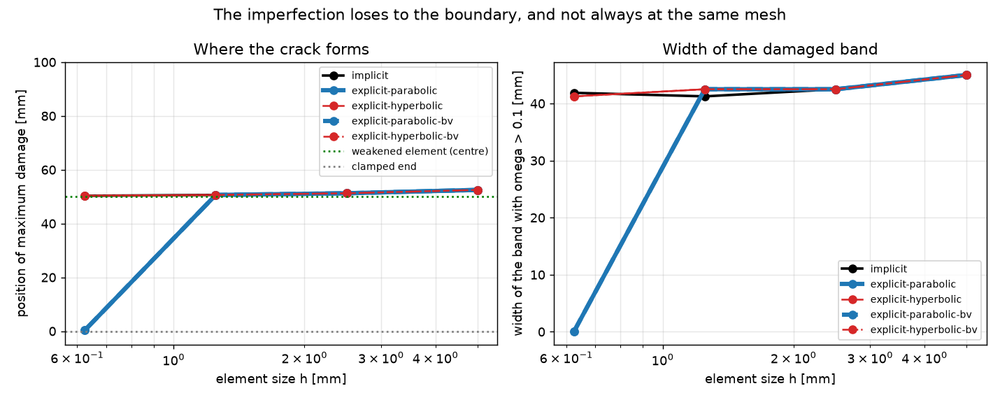
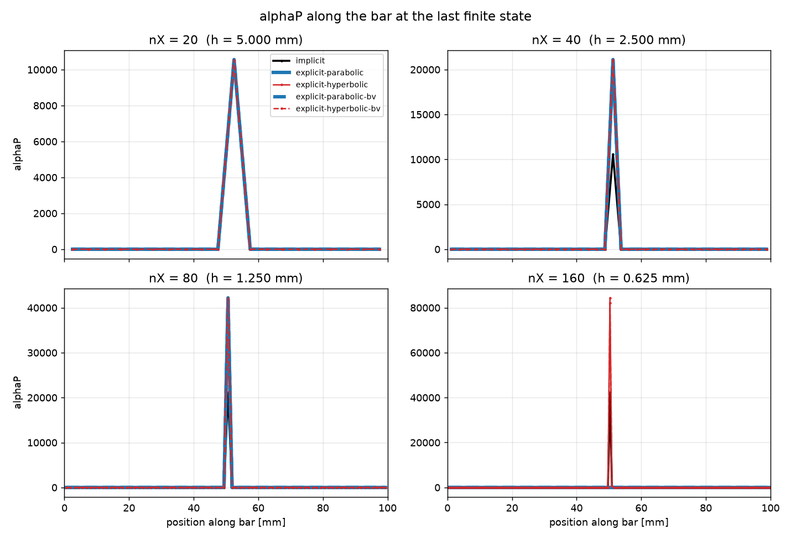
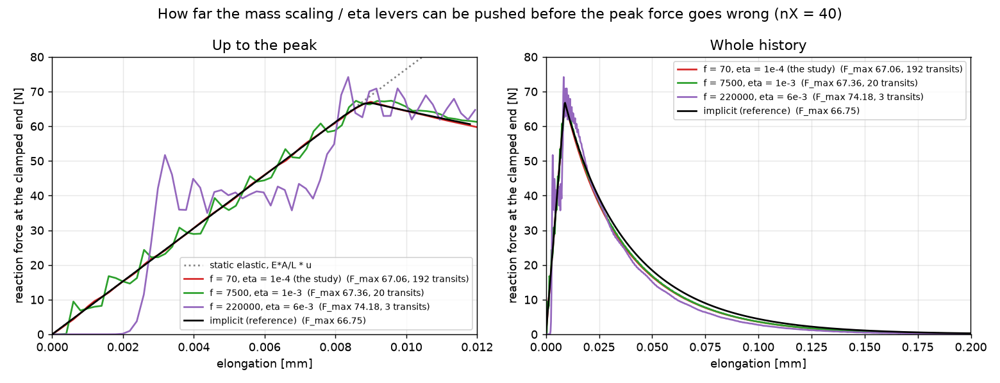
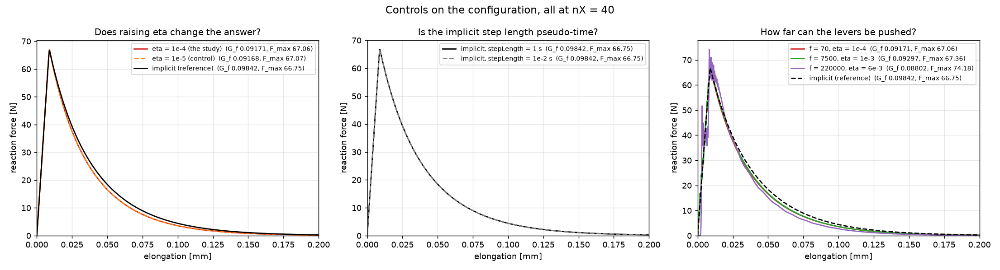

# GCDP fracture energy: implicit against explicit, parabolic against hyperbolic

**Date:** 2026-09-10 · **Machine:** `matthias-xeon`, 36 cores · **Branches:** `feat/elements-bulk-viscosity`
in both Marmot ([#84](https://github.com/MAteRialMOdelingToolbox/Marmot/pull/84)) and EdelweissFE
([#134](https://github.com/Edelweiss-Numerics/EdelweissFE/pull/134)). Runs and table from
`run_calibration.py`, figures from `plot_results.py`.

**Question:** do the integration variants deliver the same fracture energy under the same, genuinely
quasi-static, loading? (A separate stability demonstration — the parabolic scheme diverging where
the hyperbolic one survives — needs a different, faster-lagging `eta`; see §6.) See
`Marmot/doc/pages/features/explicitdynamicsdevices.rst` for the formulation.

**Provenance.** Adding a virtual to `MarmotElement` changes its vtable, so a stale `libMarmot` is
wrong, not merely old — rebuilt and reinstalled before every run. Marmot `ctest` 50/50. EdelweissFE
`testfiles/edelweiss-only` and `testfiles/marmot`: 3 failures, all one pre-existing environment fault
(matplotlib's LaTeX backend), 12 skips for private materials absent from this checkout.

## 1. The model

100 × 5 × 5 mm bar, `GC3D20R`, GCDP, `l = 5 mm`, Duvaut-Lions viscosity zero, pulled to **0.2 mm over
1 s** for every variant (the endpoint `AlphaP_AMR_Study` uses, so `G_f` is comparable to its
reference **0.098 N/mm**). Quarter-symmetry restraint (not a fully fixed face, which would suppress
the Poisson contraction the reaction is measured against); end zones strengthened 1.5× over one
non-local length so the only imperfection a crack can find is the intended 0.7 %-weakened central
column. Explicit density mass-scaled 70×.

| variant | non-local field | its inertia | bulk viscosity |
|---|---|---|---|
| `implicit` | elliptic, Newton-Raphson | — | — |
| `explicit-parabolic` | 1st order in time | viscosity `eta` | no |
| `explicit-hyperbolic` | 2nd order in time | micro-inertia `m_k` | no |
| `explicit-parabolic-bv` / `-hyperbolic-bv` | as above | as above | `b1 = 0.06, b2 = 1.2` |

## 2. Deriving `eta`, `m_k`, and the mass scaling `f`

None of the three is free, and none can be chosen without the other two:

- **`m_k = eta²/4`** — the largest value that keeps the zeroth-order reaction mode from ringing, and
  the best because `dt ∝ √m_k`. One parameter, not two.
- **`eta` has a floor**, from wanting the mesh (not the non-local field) to set `dt`. Both limits are
  linear in `h` for `h ≪ l`, so their ratio is mesh-free: `eta ≥ √C·l/c_d`, i.e.
  `m_k ≥ (C/4)(l/c_d)²` — the micro-inertia must exceed the square of the time a mechanical wave
  needs to cross one non-local length. `C` is the element's Gershgorin constant, calibrated here as
  **40** from the measured ratio (1.258 at nX = 40, 1.354 at nX = 80).
- **`eta` has a ceiling**, from the artificial lag it costs as real dissipative work — measured, not
  closed-form (§4: a tenfold change moves `G_f` by 0.03 %).
- **`f` has a ceiling from accuracy, not stability**: it raises the `eta` floor as `√f` (via
  `c_d ∝ 1/√f`), so the two must move together, and its own limit comes from the kinetic energy it
  introduces (§4: 1.4 % kinetic share already costs 6–11 % on the peak force).

With `λ+2μ = 34000 MPa`, `ρ = 2.4e-9 t/mm³` (`c_d = 3.7639e6 mm/s` unscaled): pick `f = 70` →
`c_d = 4.4987e5 mm/s` → floor `eta ≥ 7.0294e-5 s` → choose `eta = 1e-4 s` (1.42× margin) →
`m_k = eta²/4 = 2.5e-9 s²` (2.02× above its own floor).

The margin is what mass scaling consumes: unscaled, `eta = 1e-4` clears the floor by 11.9×; at
`f = 7500` only 1.37× (still accurate, §4); at `f = 220000` the floor is missed in spirit even though
nominally cleared, and the peak force is measurably wrong (§4). Structurally, mechanical dominance
(`eta ≥ √C·l/c_d`) and a damage front no slower than the mechanical wave (`eta ≪ 2l/c_d`) are
incompatible since `√C ≈ 6.3 > 2`: buying a mesh-set increment always means a damage front about 3×
slower than the elastic wave, acceptable only because this loading is 4270 wave transits long.

`run_calibration.py --estimate` prints the floor for a requested `f` and whether the requested `eta`
clears it, without running anything.

## 3. Results

Twenty runs, ~9 h wall as six concurrent processes. Every one reports a kinetic share of **0.00 %**.

```
variant                     nX  h [mm]      dt [s] increments samples F_max [N] G_f [N/mm]   F_end T/W_ext    status
implicit                    20   5.000           -       1000    1002     66.78    0.09969    0.4%       -        ok
explicit-parabolic          20   5.000  1.0146e-06     985612    1001     67.08    0.09983    0.4%   0.00%        ok
explicit-hyperbolic         20   5.000  8.8530e-07    1129565    1147     66.89    0.09983    0.4%   0.00%        ok
explicit-parabolic-bv       20   5.000  1.0146e-06     985612    1001     67.09    0.10046    0.5%   0.00%        ok
explicit-hyperbolic-bv      20   5.000  8.8530e-07    1129565    1147     66.91    0.10049    0.5%   0.00%        ok

implicit                    40   2.500           -       1000    1002     66.75    0.09842    0.4%       -        ok
explicit-parabolic          40   2.500  5.0730e-07    1971223    1002     67.06    0.09171    0.3%   0.00%        ok
explicit-hyperbolic         40   2.500  5.0730e-07    1971223    1002     67.06    0.09171    0.3%   0.00%        ok
explicit-parabolic-bv       40   2.500  5.0730e-07    1971223    1002     67.09    0.09243    0.3%   0.00%        ok
explicit-hyperbolic-bv      40   2.500  5.0730e-07    1971223    1002     67.09    0.09243    0.3%   0.00%        ok

implicit                    80   1.250           -       1000    1002     66.70    0.09115    0.3%       -        ok
explicit-parabolic          80   1.250  2.5365e-07    3942445    1002     66.99    0.08788    0.2%   0.00%        ok
explicit-hyperbolic         80   1.250  2.5365e-07    3942445    1002     67.00    0.08788    0.2%   0.00%        ok
explicit-parabolic-bv       80   1.250  2.5365e-07    3942445    1002     67.08    0.08856    0.3%   0.00%        ok
explicit-hyperbolic-bv      80   1.250  2.5365e-07    3942445    1002     67.08    0.08856    0.3%   0.00%        ok

implicit                   160   0.625           -       1000    1002     66.69    0.08759    0.2%       -        ok
explicit-parabolic         160   0.625  1.2682e-07    7884888    1001         -          -       -   0.00%  DIVERGED
explicit-hyperbolic        160   0.625  1.2682e-07    7884888    1001     66.97    0.08604    0.2%   0.00%        ok
explicit-parabolic-bv      160   0.625  1.2682e-07    7884888    1001         -          -       -   0.00%  DIVERGED
explicit-hyperbolic-bv     160   0.625  1.2682e-07    7884888    1001     67.06    0.08675    0.2%   0.00%        ok
```

## 4. Findings

- **Parabolic and hyperbolic agree wherever both are stable** — identical to all five digits at
  nX = 40 and 80 (0.09171 and 0.08788 in `G_f`, respectively). At h = 0.625 mm the parabolic variants
  go NaN (caught by the NaN guard added in #134, `4580ab38`, rather than reported as success) while
  both hyperbolic ones finish, tracking `1/h` increments instead of `1/h²`.
  
  
- **Peak force is a material property again**: implicit 66.69–66.78 N, explicit 66.89–67.09 N, flat
  to 0.13 % across a factor of 8 in element size.
- **`G_f` converges**, monotonically both legs (implicit 0.0997→0.0876, hyperbolic 0.0998→0.0860),
  toward ~0.085–0.086 — `AlphaP_AMR_Study`'s 0.098 is a **coarse-mesh value**, reproduced only at
  nX = 20–40.
  
- **Bulk viscosity adds under 1 %** of `G_f` (+0.6 to +0.8 % across the four meshes) at this
  quasi-static rate, and **does not interact with the micro-inertia** (same bv increment to three
  digits with and without it). This is ~120× less than the 27–55 % measured on an earlier, 1e-3 s-ramp
  version of this deck (`c/c₀` scaling of the Landshoff term), because essentially all of that bias
  is generated *inside the damaged elements* (applying bv everywhere except them changed `G_f` by
  only −1.6 %, against +37.9 % applying it everywhere) — hence the optional
  `bulk viscosity damage degradation` property added in #84, not urgent at this rate but the right
  fix for a faster one.
- **All 18 stable runs crack centrally**, at the same site as the implicit reference, narrowing with
  refinement (52.50→50.31 mm crack site, 45.00→41.25 mm band width, nX = 20→160).
  
  
  Away from the localisation band, `alphaP` sits where the implicit run puts it and the two
  hyperbolic variants lie on top of each other — no sign of ringing driving the hardening variable.
- **Configuration controls, all measured, none assumed:** raising `eta` tenfold (to 1e-5) changes
  `G_f` by 0.03 % at nX = 40 (7.7 h control run); the implicit `stepLength` is pseudo-time (1 s and
  1e-2 s give identical results to six figures — the explicit ramp is matched by `T/W_ext`, not by
  the label "1 s"); and pushing `f`/`eta` together buys about **10×** before accuracy breaks —
  `f = 7500, eta = 1e-3` is still accurate (+1.4 % on `G_f`, 10× cheaper), `f = 220000, eta = 6e-3`
  is not (peak force +10.6 % at a kinetic share of only 1.4 %). The binding constraint on the mass
  scaling is accuracy, not stability.
   

## 5. Watch the diagnostics, not just the curve

Mass-proportional damping controls the *low* modes only: at `m_k = eta²/4` the reaction mode is
critically damped but the shortest-wavelength modes are barely touched, and GCDP's damage rides an
accumulating internal variable that writes in an overshoot irreversibly. Two things worth reading
before trusting a curve: the `non-mechanical-inertia (not an energy)` row of the energy table (should
decay after the initial transient and every refinement, not persist), and `alphaP` away from the
crack in the Ensight output (rising where nothing is loading is ringing feeding into damage). Neither
appears in this deck's runs. If either does, the fix is a stiffness-proportional damping term, not
implemented — see the limitations section of the Marmot doc page.

## 6. The stability demonstration lives at a different `eta`

Raising `eta` to afford an increment also lifts the *parabolic* scheme's own limit
(`dt ≤ 2·eta/(1+C l²/h²)`, quadratic in `h`, density-free), so the two questions — "do the schemes
agree" and "does the parabolic scheme's unchecked limit bite" — do not share one deck. The
unambiguous demonstration is an earlier, narrower version of this study at `eta = 1e-5` and a 1e-3 s
ramp: the parabolic scheme went NaN at the peak while the hyperbolic one ran to the endpoint on an
identical increment, two full refinement levels past the threshold (superseded for `G_f`, since that
ramp was not quasi-static: `T/W_ext` and a clamped-end reaction of 0.50 N against 27.56 N required by
statics gave it away). At this deck's calibrated `C = 40`, the nX = 160 parabolic limit is `7.81e-8`
against the `1.2682e-7` actually taken (exceeded by 1.62×) — real, but a slightly coarser mesh or
larger `C` would have hidden it, which is why it is not leaned on as *the* demonstration here.

## 7. Defects found and fixed

None was in the formulation under review; all produced plausible numbers.

**In this example:** (1) `output-frequency` gates the *sampling rate* of the exported history, not
just logging — at its old value the explicit runs produced 10-row histories whose first sample
already sat past the peak, reporting a softening-branch force as `F_max`; cadence is now derived per
mesh for ~1000 samples, with a `samples` column to make undersampling visible. (2) A failed implicit
run was reported `ok`; completeness is now checked against the prescribed elongation. (3) A run was
reused on `RF.csv` existing alone, which would carry undersampled results forward; reuse is now keyed
on deck identity. (4) `maxInc=1e-2` walked the implicit leg into the limit point at nX = 80; `1e-3`
takes all four meshes to 1000 increments with no cutbacks.

**In the stack:** (5) Marmot's warning channel (`MarmotJournal`) was built on a null streambuf and
never pointed anywhere, so every warning on this path — including the element's own long-standing
`'sdv' is discouraged and deprecated` — was silently discarded; wired to `std::cout`. (6) It also did
not flush, so a run killed by a timeout or scheduler (routine for explicit dynamics) lost its
warnings even so; now flushed.

## 8. Reproducing

```bash
ssh xeon
conda activate next_v2611
cd ~/constitutive_modeling/next_v2611/EdelweissFE/examples/GCDP_implicit_vs_explicit_fracture_energy_calibration

python run_calibration.py --estimate --meshes 20,40,80,160                  # increments + eta floor, runs nothing
PYTHON_GIL=0 python run_calibration.py --meshes 20,40,80,160 --threads 8    # ~9 h as 6 concurrent processes
python plot_results.py                                                     # figures/
```

Runs land in `run_<variant>_nX<n>/` and are reused only if their deck still matches what the script
would write now; a non-default `--mass-scaling` or `--nonlocal-viscosity` gets its own directory.
`rm -rf run_*` matches everything `run_calibration.py` writes.
